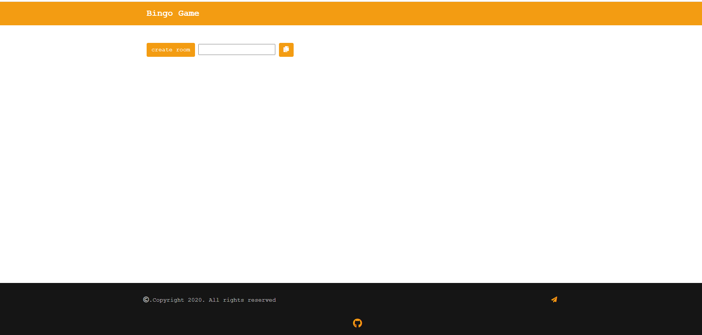

# Multiplayer Bingo Game

[](LICENSE)
[](https://nodejs.org/)
[](https://bingogp.onrender.com/)
[](https://claude.ai/code)

A real-time multiplayer Bingo game built with Node.js, Express, and Socket.io. Support for 2-6 players with optimized performance and scalability.



## Features

- **Real-time Multiplayer**: Play with 2-6 players simultaneously
- **Private Rooms**: Create private game rooms with unique IDs
- **Live Updates**: Real-time number calling and player status updates
- **Optimized Performance**: 10-25x faster rendering with efficient algorithms
- **Auto Cleanup**: Automatic removal of idle rooms after 30 minutes
- **Responsive Design**: Works on desktop and mobile devices
- **Memory Efficient**: No memory leaks with proper disconnect handling

## Live Demo

Try the live version here: **[https://bingogp.onrender.com/](https://bingogp.onrender.com/)**

## Tech Stack

- **Backend**: Node.js, Express.js
- **Real-time Communication**: Socket.io
- **Template Engine**: EJS
- **Security**: Helmet.js, CORS
- **Frontend**: Vanilla JavaScript, HTML5, CSS3

## Prerequisites

Before you begin, ensure you have the following installed:

- [Node.js](https://nodejs.org/) (v12.0.0 or higher)
- [npm](https://www.npmjs.com/) (comes with Node.js)

## Installation

1. **Clone the repository**
   ```bash
   git clone https://github.com/avinashboy/Bingo-game.git
   cd Bingo-game
   ```

2. **Install dependencies**
   ```bash
   npm install
   ```

3. **Start the development server**
   ```bash
   npm run dev
   ```

   Or for production:
   ```bash
   npm start
   ```

4. **Open your browser**

   Navigate to `http://localhost:3000`

## Configuration

The game can be configured via the `config.js` file:

```javascript
module.exports = {
  PORT: process.env.PORT || 3000,

  ROOM: {
    MIN_PLAYERS: 2,                      // Minimum players to start
    MAX_PLAYERS: 6,                      // Maximum players per room
    IDLE_TIMEOUT_MS: 30 * 60 * 1000,     // 30 minutes idle timeout
    CLEANUP_INTERVAL_MS: 5 * 60 * 1000,  // Check every 5 minutes
  },

  GAME: {
    GRID_SIZE: 5,          // 5x5 Bingo grid
    MAX_NUMBER: 25,        // Numbers 1-25
    STRIKES_TO_WIN: 5,     // Need 5 strikes to win
  }
}
```

### Customization Examples

**Change player limits:**
```javascript
ROOM: {
  MIN_PLAYERS: 3,
  MAX_PLAYERS: 8,
}
```

**Change grid size (for custom Bingo variants):**
```javascript
GAME: {
  GRID_SIZE: 7,
  MAX_NUMBER: 49,
  STRIKES_TO_WIN: 7,
}
```

## How to Play

1. **Create a Room**
   - Click "Create Room" on the homepage
   - Share the room link with friends

2. **Join a Room**
   - Enter your name
   - Wait for other players to join (minimum 2 players)

3. **Play Bingo**
   - Numbers are called randomly by players
   - Click numbers on your grid as they're called
   - Complete 5 strikes (rows, columns, or diagonals) to win

4. **Win**
   - First player to complete 5 strikes wins
   - Game displays the winner to all players

## Project Structure

```
Bingo-game/
├── public/
│   ├── css/
│   │   ├── style.css       # Main styles
│   │   └── loder.css       # Loading animations
│   └── js/
│       ├── app.js          # Main game logic
│       ├── Base.js         # Base utilities
│       ├── check.js        # Win condition checks
│       └── main.js         # Client initialization
├── views/
│   ├── index.ejs           # Homepage
│   └── play.ejs            # Game room
├── config.js               # Configuration constants
├── server.js               # Express & Socket.io server
├── package.json            # Dependencies
└── README.md               # This file
```

## Performance Metrics

Recent optimizations have significantly improved performance:

| Operation | Before | After | Improvement |
|-----------|--------|-------|-------------|
| DOM Rendering | 25-50ms (25 reflows) | 2-5ms (1 reflow) | **10x faster** |
| Number Lookup | O(n²) - up to 25 ops | O(1) - 1 op | **25x faster** |
| Player List Update | Always re-render | Only on change | **5x fewer updates** |

For detailed performance improvements, see [IMPROVEMENTS.md](IMPROVEMENTS.md)

## API Endpoints

| Method | Endpoint | Description |
|--------|----------|-------------|
| GET | `/` | Homepage |
| GET | `/create` | Create a new game room |
| GET | `/join?game={roomId}` | Join an existing room |

## Socket Events

**Client → Server:**
- `user-name` - Player joins with name
- `number` - Player calls a number
- `uwin` - Player wins the game

**Server → Client:**
- `list_of_user` - Updated player list
- `number` - Number called by player
- `swin` - Player won notification
- `player-disconnected` - Player left the game
- `goto-main-page` - Redirect to homepage (errors)

## Environment Variables

Create a `.env` file for custom configuration:

```env
PORT=3000
BASE_URL=http://localhost:3000
NODE_ENV=development
```

## Contributing

Contributions are welcome! Please follow these steps:

1. Fork the repository
2. Create a feature branch (`git checkout -b feature/amazing-feature`)
3. Commit your changes (`git commit -m 'Add some amazing feature'`)
4. Push to the branch (`git push origin feature/amazing-feature`)
5. Open a Pull Request

## Known Issues

- Game requires minimum 2 players to start
- No game history or statistics tracking
- No reconnection logic for disconnected players

## Future Enhancements

- [ ] Add user authentication
- [ ] Implement game history and leaderboards
- [ ] Add chat functionality
- [ ] Support for custom Bingo patterns
- [ ] Mobile app version
- [ ] Reconnection logic for dropped connections
- [ ] Multiple concurrent rooms dashboard

## License

This project is licensed under the MIT License - see the [LICENSE](LICENSE) file for details.

## Authors

- **avinashboy** - *Initial work* - [GitHub](https://github.com/avinashboy)
- **nibfic99** - *Collaborator* - [GitHub](https://github.com/nibfic99)

## Acknowledgments

- Built with [Socket.io](https://socket.io/) for real-time communication
- Security powered by [Helmet.js](https://helmetjs.github.io/)
- Deployed on [Render](https://render.com/)
- Developed with [Claude Code](https://claude.ai/code) - AI-powered coding assistant by Anthropic

## Support

If you encounter any issues or have questions:

1. Check the [Issues](https://github.com/avinashboy/Bingo-game/issues) page
2. Create a new issue with detailed information
3. Contact the maintainers

---

**Made with ❤️ by the Bingo Game Team**
